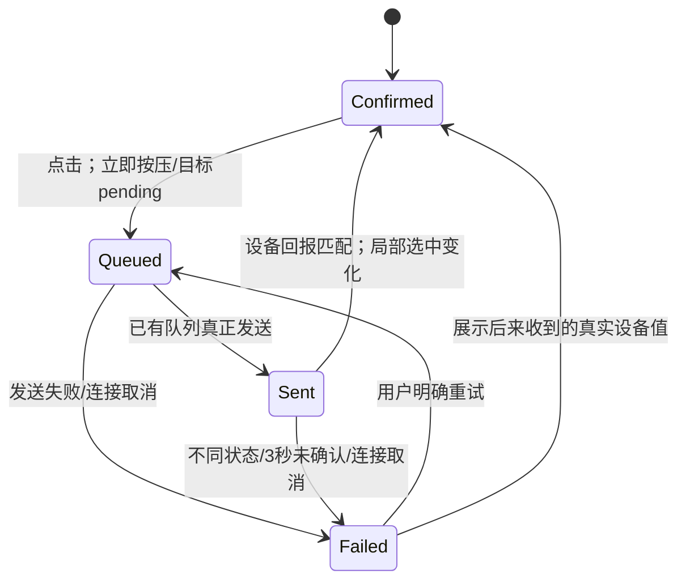
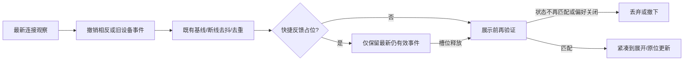

# 原生动效重设计方案

基线：`2becbf0`；2026-09-29；状态：待实施。本文是本项目的初始设计建议，所有毫秒值、位移、比例和弹簧参数均需要真机调优，**不是苹果官方标准**。

## 一套语言：立即响应，等待可见，确认后变化

动作发生的同一轮 UI 更新就给按压或等待反馈；设备真实值只由已有会话报告改变。三层各有责任：

- 输入层：Button 原生按下反馈，拖动跟手，键盘焦点立即出现。
- 事实层：BudsCore 的 queued/sent/confirmed/失败、设备值、generation；不带动画时间，不因窗口关闭取消已发命令。
- 呈现层：有限的 opacity、selection 与 HUD 形变。动画可中断，反馈不能消费或伪造事实。

主面板是清晰直接的控制器；inspector 更轻，依附入口；连接 HUD 是短暂告知，允许一处有轻微弹性；快捷 HUD 是操作回执，以快速稳定为主。不会把所有元素统一成弹簧，也不会给每次成功加庆祝动画。

## 参数初始值

继续使用 `UI/MotionTokens.swift` / `HUDMotionTokens`，不建可配置动画框架。将“状态透明度”和“几何变化”分开，避免 `reduceMotion` 返回短动画却仍驱动 geometry。表内“不附加”表示尊重原生控件/窗口已有呈现，不代表 OS 完全没有动画。

| 场景 | 建议范围 / 起点 | 曲线 | 位移、缩放、透明度 | 中断与 reduced |
| --- | --- | --- | --- | --- |
| 原生 Button/Toggle/Menu | 系统默认，不加全局延迟 | 系统 | 不附加 scale/blur | 保持系统行为 |
| 自定义 plain 按钮按压 | 按下当帧变色；释放 80–120 ms，起点 100 | easeOut | 0 pt，scale 1；底色强度变化 | 松开/拖离立即重定向；reduced 同样仅变色 |
| hover | 80–120 ms，起点 100 | easeOut | 底色 opacity 0↔0.06；无位移 | 离开即可反向；键盘焦点不淡入 |
| ANC/EQ 已确认选中 | 160–220 ms，起点 180 | easeOut | 仅同一控件内底板移至新槽；文本不位移 | 新设备报告即重定向；reduced 静态底板+100 ms 色/透明度 |
| pending 图标/状态文字 | 100–140 ms，起点 120；输入时状态立即设置 | easeOut | opacity 0↔1；固定槽位；无缩放 | confirmed 在下一帧即可取代 pending，不强制“最短等待” |
| 状态/错误内容淡换 | 120–180 ms，起点 140 | easeOut | opacity；无模糊 | 最新状态优先；持久错误不按动画计时清掉 |
| ANC 强度区域 | 160–220 ms，起点 180 | easeOut | 新区域淡入，最多 2 pt 可选位移；外层测高不补间 | 确认 ANC 才出现；reduced 仅 opacity 100 ms |
| 电量数值/条 | 180–240 ms，保留 220 | easeOut | 真实数值间过渡；条到真实长度；无回弹 | 相同值不重播；首次出现直接显示；reduced 数字/长度立即更新 |
| 主 popover/详情/说明 | 保留 AppKit/SwiftUI 默认呈现 | 系统 | 不再叠加整面板 scale/offset | 再次点击/外部点击立即接受；不等自定义动画结束 |
| 独立 EQ/新功能窗口 | 原生 orderFront/close；若内部换状态，120–160 ms | 系统+局部 easeOut | 窗口不另飞入；内部 opacity | 已可见则只置前，不重播；reduced 同 |
| 快捷 HUD 外壳 | 入场 120–180 ms，起点 160；退场 140–180 ms，起点 160 | easeOut | alpha 0↔1；0 pt；scale 1 | 同一操作更新原壳；新操作取消旧 completion；reduced 100 ms opacity |
| 快捷 HUD 阅读时间 | success 1.6 s；failure 2.6 s（可在 2.4–3.2 s 调优） | 无 | 停留不是动画 | pending 由操作终态控制，不用 1.6 s 清除；错误长文可两行 |
| 连接 HUD 初次进入 | 180–240 ms，起点 220 | easeOut | y +6→0 pt；alpha 0→1；scale 1 | 同事件更新资料不重入；reduced 直接最终几何+120 ms alpha |
| 连接 HUD 紧凑→展开 | 保留 spring response 0.48 / dampingFraction 0.80 为比较基准；调优范围 response 0.40–0.50 / damping 0.80–0.90 | 仅此场景 spring | actual card 268×64→当前事件目标尺寸；不另叠整体 scale | 从当前呈现重定向；reduced 完全无几何插值 |
| 连接 HUD 内容出现 | 160–220 ms，起点 180；与展开重叠 | easeOut | alpha，位移至多 2 pt | 快照变更不重置时序；reduced 同时淡入，不分段错峰 |
| 连接 HUD 阅读/退场 | 保留展开后 2.65 s、hover 退出后 1.6 s；内容退出 140–180 ms，容器收回 240–320 ms，消失 160–200 ms | 收回/淡出 easeOut | 收至 compact 后 alpha→0；最后 y 至多 +4 pt | 状态过期立即撤销语义；reduced 保持展开大小淡出，不先缩回 |

弹簧 response 是响应参数，不是精确完成时间。不要用 response 值当操作确认或 dismiss 的固定截止时间。以上连接 HUD 节奏保留了旧版本用户喜欢的停留与“胶囊展开”意图；只有实机比较证明更好才调整。

## 控制命令与动画的边界

图中 Confirmed 指最后已知真实值，不是“本轮一定成功”。失败后收到迟到回报可以更新真实选中，但不追补旧操作的成功 HUD。queued/sent 期间的真实手机回报也可以更新当前选中，目标 pending 单独显示，直到已有会话决定终态。

同功能正在提交时重复点击不再发 SET，也不取消原操作的结果反馈；同一 spinner 继续即可。反向视觉动画可以随新确认值转向，但不在业务层引入“最后一次点击排队覆盖”功能。另一个独立功能是否可操作仍按现有 session 限制，动画不新增全局锁。

## 关键场景前后对比与完整流程

### 1. 主面板、详情、说明及窗口交接

现在：主视图根据多种整个模型值设置祖先动画，几何测量又影响 popover；主面板首次打开还可能同步拉起新功能窗。

目标流程：入口按下当帧反馈 → 原生 popover 锚定菜单栏展开 → 内容直接采用当前设备快照 → 详情/说明仍由原生 popover 呈现。主面板不因相同轮询值闪动，不逐行飞入；关闭后重开不重播之前的错误或 pending 入场仪式，只展示当前状态。

- 首次新功能优先时，只让新功能窗口成为 key，不在同一调用链再次 makeKey 主面板。用户关掉介绍后自行打开控制器；不强制再弹第二层。
- EQ 入口先关闭主面板，再把持有的独立 NSPanel 置前；存在时不重新缩放、不丢正在编辑的窗口状态。保持其固定尺寸和 `sizingOptions = []`。
- 错误是局部信息，不能新建模态 sheet；点击外部关闭不丢业务操作，也不造成等待回执在重开时重复触发。
- Reduce Motion 使用系统原生呈现，去掉自定义空间运动。快速重复开关不为动画额外加 debounce。
- 实施前验证首次介绍 key ownership；这是风险项，不先根据静态推测重写 AppDelegate。

### 2. ANC/强度与 EQ 预设

现在：真实选中与目标 spinner 已分离；pending 会让所有 segment（含 spinner）变淡，状态行临时插入；ANC 确認时出现强度区。

目标流程：按下底色立即响应 → 已确认底板仍留原槽，目标槽固定位置出现清晰 pending → 匹配回报到达时，底板在 180 ms 内转向真实新值，同时撤下 pending → 无额外成功吐司。

- waiting 与 unavailable 区分：不可重复提交，但 pending 图标保持正常对比；整个控件只有真正不可用时整体弱化。
- ANC 强度仅按 confirmed mode 出现。淡入范围限定于强度区；不让整块 header/footer 一起移动。有限的内容尺寸变化允许发生，不为“稳定”长期留整块空白。
- 超时/不同状态：显示实际读回状态，目标 pending 结束，区域内显示原因与适合的重试入口。不得先让底板到目标再退回制造成功假象。
- 外部同步：同一 confirmed transition 更新，无按压或成功通知。同值回报零动画。
- 减少动态效果：移除 matchedGeometry 路径，选中直接更新，允许 100 ms 颜色/淡换；不需要把所有反馈完全关掉。

### 3. 游戏模式

目标流程：原生 Toggle 保持真实 binding，点击后在已预留的小槽显示等待 → 收到真实开关值才跟随系统切换 → 失败保留真实值和局部错误。手指按下的反馈不等于开关已经生效；不靠本地 State 先翻转。

pending 槽位不挤压说明文字或推走开关。原生 Toggle 在真实机器上是否短暂展示乐观值必须验证；若可见，先检查 binding/transaction 配合，不自造另一套开关。unknown 状态明确读取中/未知，不能默认 false。

### 4. 快捷 HUD：一次操作，一条反馈

现在：每条反馈新建 hosting view，全部固定 1.6 s；重复按键可能清掉第一次回执。

目标流程：快捷键 → 单个稳定 NSHostingView 中显示“正在切换…” → queued/sent 期间保留 → 相同外壳淡换为真实结果 → 从终态开始计算阅读时间 → 淡出。模式未知则明确“正在读取当前模式…”，2 秒到期给“未收到当前模式，未执行切换”。

- 不因鼠标移到另一显示器把同一操作的终态搬过去。新操作才重新选屏。
- 等待时重复按键保留同一反馈和原始截止时间；不刷红错误、不清反馈 owner、不重新建立业务超时。
- 操作终态与 presentation generation 分开：前者保证哪个回执归谁，后者保证旧 fade completion 不隐藏新内容。
- 主面板打开时，结束快捷 HUD 的展示所有权；已经发送的命令仍由 session 完成，结果在面板展示。未知模式的一次性意图按既有策略取消。
- 快捷菜单继续仅错误反馈，保留安静定位。断开/切换设备/唤醒清理旧反馈；正常未被接管的超时必须有终态。
- 错误可到两行，窗口在显示错误前一次性选择足够尺寸，不单行截断具体原因。reduced 只淡换，无移动。

### 5. 连接 HUD：先判事件是否有效，再决定怎样出现

连接事件到达时先告诉用户“已连接”，资料未齐允许保留现有最多 1 秒的 readiness 等待，但不能让旧事件在断开后补播。资料迟到只更新对应字段，不重启完整弹出。断线去抖 650 ms 是抗抖产品策略，不是可随动画改短的参数。

- 用户主动断开不弹断线通知，但应撤销旧“已连接”。恢复连接即撤下旧断线，即使 reconnect 提示关闭。
- 同一事件资料刷新不重排生命周期、不重置阅读时钟；不同有效事件原位换文案，不能播完过时动画再排下一条。
- hover 暂停保持；事件在同一位置替换时保留/重新计算 hover，不依赖一定会补发 onHover。
- 快捷操作优先；旧卡片交出槽位应直接消失，避免两层叠加。这一即时撤下有目的，不强制加淡出。
- 若逐帧验证确认双几何驱动造成裁切，采用一个可见几何拥有者：AppKit 非激活窗口仅提供覆盖最大卡片的固定画布（当前最大 350×120），SwiftUI 右上锚定实际 surface 进行形变。透明区域必须穿透点击，hover 区按实际 surface；如果不能满足点击范围和 shadow 边界，保留现有宿主，不交付半成品重构。
- reduced 从最终卡片尺寸开始淡入；保持；同尺寸淡出。不走 compact→expanded→compact，只给 opacity 120 ms。

### 6. 电量与 Header

相同回报不动；首次得到电量直接显示真实数字，不从 0 计数。后续变化只动画该槽位的数字/条；未知保持未知，盒电量按现有有效数据规则增减，不为了稳定宽度伪造 C 值。菜单栏 L/R 两行保持 AppKit 精确布局、即时文字更新，不滚动数字或弹跳图标。

连接中状态徽标不呼吸闪烁；已有原生进度指示只在 busy 显示。主面板连接内容与电量区变化只做局部 opacity；reduced 不 move。手机报告一次带来多字段更新时，不分散人工 stagger，保持同一事实快照。

### 7. 刷新、快捷键和更新图标

- 设备信息刷新：请求入队立即忙碌；仍显示旧固件值；真正查询返回才给小勾（1.2 秒后恢复刷新图标）。失败给原位简短“刷新失败，重试”及静态错误图形，不清缓存。重复点击合并/禁用，不多次假转。取消/断开退出忙碌且明确本次未完成。
- 快捷键：录制→无效输入可以显示错误；随后成功则清旧 note，退出录制；Esc 清本次错误并恢复原绑定。焦点/热键恢复按现有机制，不淡出可操作焦点，不弹 HUD。
- 更新：灰色→查询中→蓝色可用/无更新勾/失败图形，固定 30×30。失败优先画感叹号，同时保留 availableVersion，点击仍可重试。稍后仍蓝、跳过按已有 reducer 清除。颜色之外保留 tooltip 与 AX 描述，Sparkle 的确认/下载/安装 UI 不重写。

### 8. 自定义 EQ

推子、数值、草稿曲线在输入时同步，**零补间**。切换已保存曲线时可让名称/状态/侧栏选中底色 120–160 ms 淡换；十个推子直接到对应真实草稿值，不“扫频”式依次移动。禁止对整个 editor 应用动画事务。

应用时 footer 固定 30 pt 状态槽显示等待；full list 读回匹配后才更新“使用中”。失败保留草稿和明确错误，不自动放弃；手机修改时已有 dirty/stale 保护保持。只针对确认/取消删除的 footer 按钮组做短淡换，不能在淡出过程中残留可点击的旧“确认删除”。关闭重开遵守原有草稿丢弃/保存说明，不扩张为持久草稿功能。

## 原生实现约束

- `.animation(value:)` 放在最小负责子树，动画键取显示值（如 level、selection、pending 的变化），不绑定整个可观察模型。不要在 Buds.syncSessionState 外包 withAnimation。
- geometry measurement 的 `@State` 写入使用无动画 transaction；测高阈值保留。不要将每帧展示高度写回 layout State。
- 稳定 ForEach ID、namespace 与 NSHostingView。只在真正语义切换时改变身份，不能用 `.id(UUID())` 强迫重入。
- 动画完成只管理可见性、阅读计时，不能调用蓝牙成功处理；业务超时也不等待 UI 动画。
- NSAnimationContext 与 SwiftUI 的同一几何不能各自随意配曲线。AppKit 控 alpha/窗口位置时，要明确 SwiftUI 是否仍控 surface frame；不要未经测量换成 display link。
- 用现有 work item 取消和 presentation generation；仅对真实的操作归属使用已有 operation ID/generation。不引入全局事件总线、动画引擎、通用状态管理迁移。
- 隐藏窗口时停止呈现计时/动画任务；设备会话按已有业务运行。绝不增加 16 ms/60 Hz 轮询。
- idle 无自定义持续 pulse、亮光、模糊或呼吸。ProgressView 只在可见 pending 中存在；恢复终态即撤下。
- 减少透明度与增强对比保持现有语义材质支持；这与减少动态效果是独立开关。不要为“液态玻璃”动画 blur radius。

## 哪些地方不加动画

键盘焦点与输入回显、NSSlider 跟手、快捷键捕获、实际命令发送、菜单选项触发、菜单栏电量文字、相同值重复报告、首次读到真值、错误必须立即可见的关键信息，以及隐藏窗口的后台数据同步。不要对整个主面板做缩放，不做列表逐项飞入，不给所有按钮加弹簧。

## 官方依据与本项目判断

- [Apple HIG：Motion](https://developer.apple.com/design/human-interface-guidelines/motion)：参考原生控件自带反馈与有目的的运动；页面正文依赖 JavaScript，本轮抓取仅得到入口/搜索摘要，不冒充完整阅读。
- [WWDC23：Explore SwiftUI animation](https://developer.apple.com/videos/play/wwdc2023/10156/)（20:00 Transaction，约 23:44–25:20）：祖先事务可影响同次更新的子内容，局部 animation/transaction 可以限定属性；用于本方案的作用域设计。
- [SwiftUI accessibilityReduceMotion](https://developer.apple.com/documentation/swiftui/environmentvalues/accessibilityreducemotion) 与 [AppKit accessibilityDisplayShouldReduceMotion](https://developer.apple.com/documentation/appkit/nsworkspace/accessibilitydisplayshouldreducemotion)：两层分别读取系统偏好，不能只改其中一层。
- [Apple Reduced Motion evaluation criteria](https://developer.apple.com/help/app-store-connect/manage-app-accessibility/reduced-motion-evaluation-criteria)：将开启该设置后仍可完成操作作为真实验证场景。

上面来源支持平台机制与原则；本方案的 100/180/220 ms、位移、停留与分批优先级都是针对当前产品的判断，需在 macOS 26 实机上比较。
